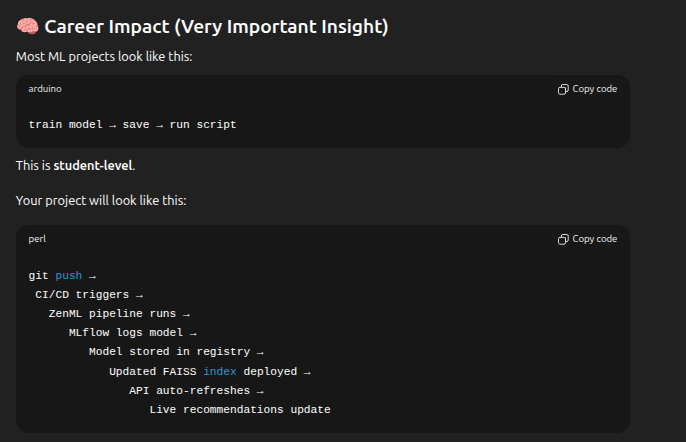

User Query
   ↓
Bi-Encoder (MiniLM) → Dense Vector
   ↓
FAISS (Retrieval Top-50)
   ↓
Cross-Encoder (MS-MARCO) Reranking
   ↓
Genre Preference Boost (Optional)
   ↓
Edition / Duplicate Cleanup
   ↓
Top-n Final Recommendations ✅

recommended structure
repo/
├─ src/
│  ├─ pipelines/
│  │  ├─ zenml_pipeline.py         # ZenML pipeline definition
│  ├─ recommend/
│  │  ├─ recommend.py              # production recommender (FAISS + rerank)
│  ├─ data/
│  ├─ models/
│  └─ utils/
├─ tests/
├─ infra/
│  ├─ docker/
│  └─ k8s/ (optional)
├─ .github/workflows/
│  └─ ci-cd.yml
├─ requirements.txt
└─ README.md

what actually MLOps here

| Part           | Analogy                                  | Tool               |
| -------------- | ---------------------------------------- | ------------------ |
| FastAPI        | Waiter taking orders & serving food      | **FastAPI**        |
| Model + FAISS  | Kitchen preparing the food               | **Your ML Model**  |
| AWS / Azure    | The building where the restaurant exists | **AWS / Azure**    |
| ZenML Pipeline | New grocery delivery & restocking        | **ZenML**          |
| CI/CD          | Hiring new chef when menu changes        | **GitHub Actions** |

